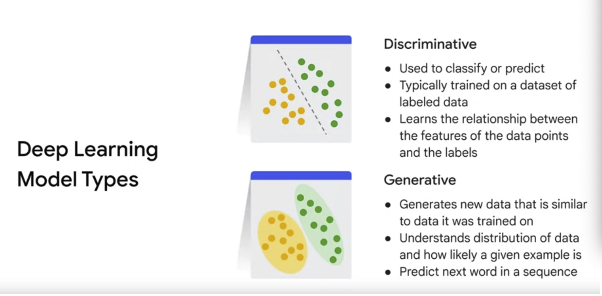
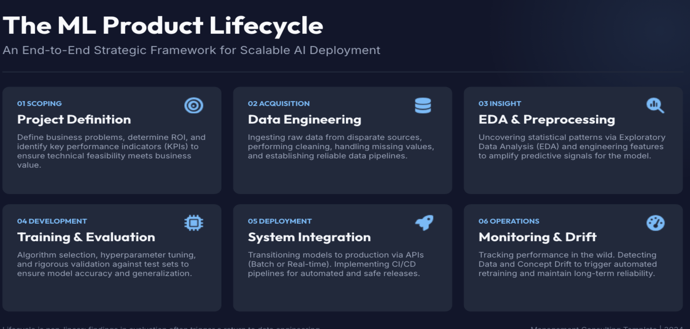
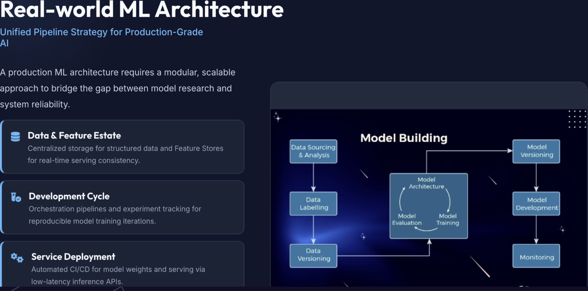
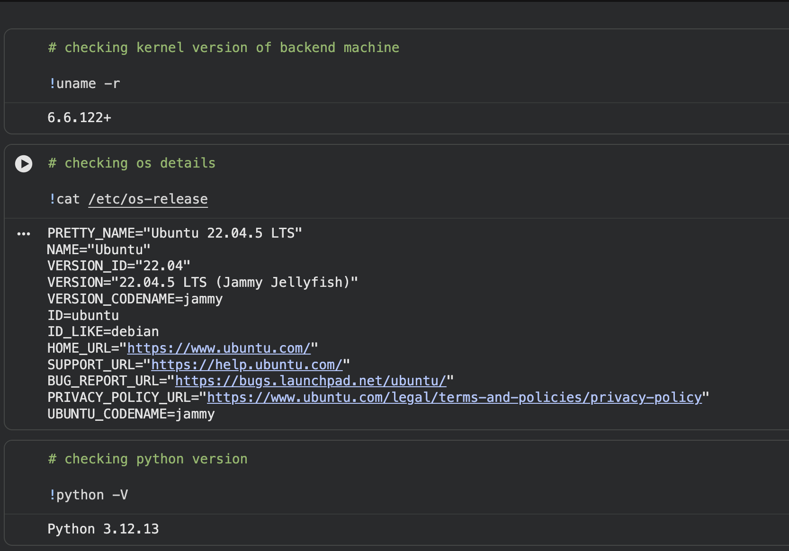
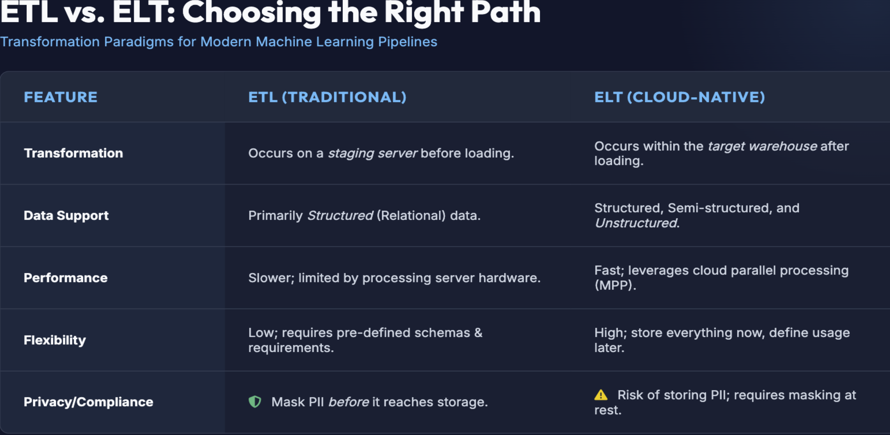
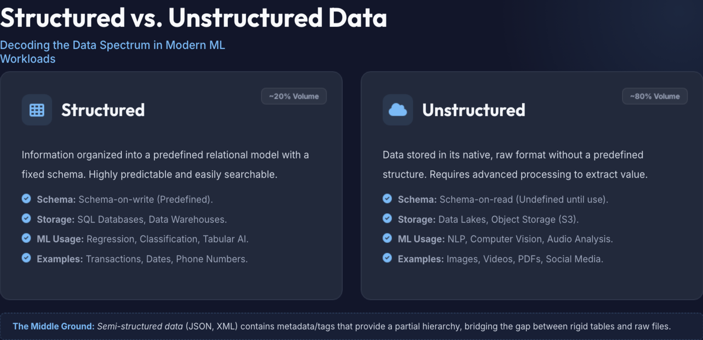
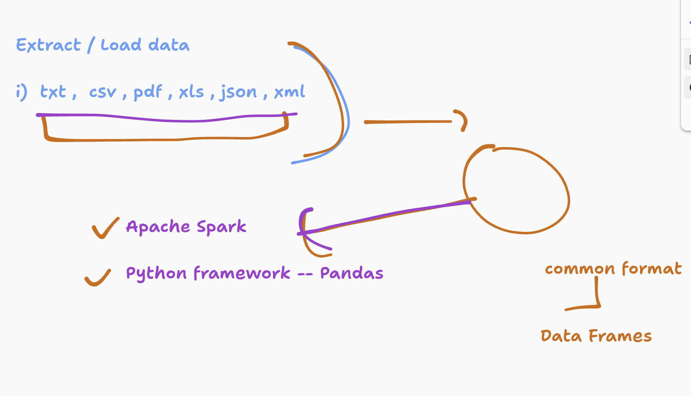
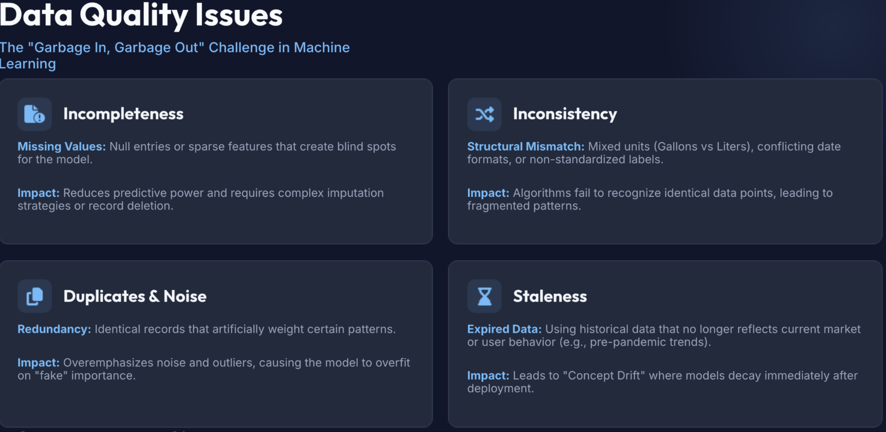
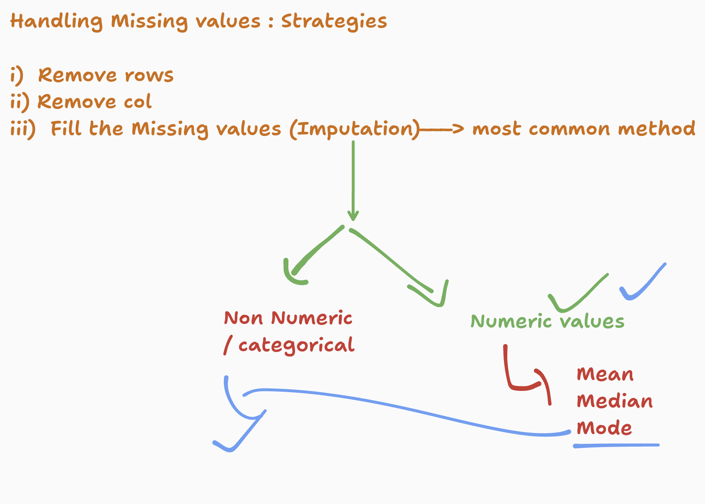

# Intuit_ML_13thMay2026

### AI types 

### ML product lifecycle 

### ML realworld Architecture 

###  checking info in Google colab 

### Data preparation for ML training 

### Data types we generate 

### Loading and handling data using data frames 

### Data Quality Issues 

### Using data hanlders 

